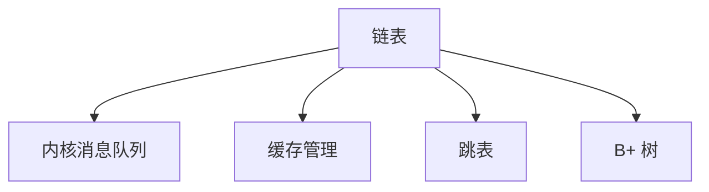

# Golang  操作链表

> 越是简单的内容越需要熟练的掌握，自己做自己的 chatgpt,
>
> 越是基础的内容越需要细细的追究，避免重复造轮子

链表常见的使用场景和问题：



由于链表的非连续性和一定程度上的方向性，在边界问题以及实际应用当中的细微问题较多，暴力的解法往往容易全盘皆错，且实际应用当中也会存在不少的问题。

本文将关注如何做到规范化解决链表问题，在部分解决类型上结合 Golang 的特性来做特有的实现。


## 链表的基础结构模板

链表节点需要包含一个值和一个指向下一个节点的指针，简单的示例如下

``` golang
type ListNode struct{
    Val int
    Next *ListeNode
}
```

当想要实现双向链表的时候则需要添加一个指向前一个结点的指针

```go
type ListNode struct{
    Val int
    Pre *ListNode
    Next *ListNode
}

type linkList struct{
    head *ListNode
    tail *ListNode
    l int
}
```

简单，但在边界问题和实际使用时侯容易弄错一些地方，在此告诫

1. **ListNode 是 value type**, 在 Golang 当中 struct 对象是一种值类型（value type），而不是指针类型（pointer type）。这意味着，当定义并初始化一个 struct 变量时，它实际上拥有自己的内存空间，而不是仅仅是指向某个内存地址的指针。当按值传递 struct 变量时，函数会复制一份该变量的副本，而不是传递变量的指针。

   但是 ListNode 内部变量需要的是指针类型，指向链表节点分配的地址，所以在初始化上需要注意几个形式：

   ```go
   // l 获得一个指针
   l := new(ListNode{})
   l := &ListNode{}
   
   // l 获得一个对象
   l := ListNode{}
   // 三者输出的结果为：
   // l is {0 <nil>}
   // l is &{0 <nil>}
   // l is &{0 <nil>}
   
   // 自己构造函数返回的是一个指针类型, 这个函数是一个模板
   func newListNode() *ListNode{
       return &ListNode{
           val: 0,
           next: nil,
       }
   }
   // 返回结果：l is &{0 <nil>}
   ```

   只理解到这里作为平时使用是足够的，但是应用时候一部分人可能因为不知道Go编译器的自动解引用，而导致指针类型和值类型混用时候分不清。
   
   比如以下的情况是不会报错的：
   
   ```go
   	l := ListNode{}
   	l1 := &ListNode{}
   	fmt.Printf("l is %v\n", l.val)
   	fmt.Printf("l1 is %v\n", l1.val)
   /** 输出结果为：
   l is 0
   l1 is 0
   */
   ```
   
   当创建了 &ListNode{} 变量之后，如果需要调用 ListNode  结构的方法和结构体字段，并不需要使用 (*l).val来获取变量，这里其中实际上是发生了自动解引用，编译器会自动将指针解引用并访问结构体字段。
   
   其实从使用来说，就对于字段访问并不会体现出很大问题，但是当我们把链表节点转化为interface时候，当定义了方法之后，在调用时候就会出现报错：
   
   ```go
   	type StructF interface{}
   	func (st *StructF) printData() {
       	fmt.Println("yes")
   	}    
   	st1 := StructF{}
       var it2 InterfaceTest = st1  // 编译出错
       it2.printData()
   ```
   
   在上述的结构体访问例子当中，指针和对象值调用时候的接收器是默认的，golang 帮我们完成了相对应的解引用和取引用，情况如下：
   
   - 用**值类型**的实参调用形参为**值类型**的方法
   - 用**指针类型**的实参调用形参为**值类型**的方法（会进行“自动解引用”）
   - 用**值类型**的实参调用形参为**指针类型**的方法（会进行“自动取引用”）
   - 用**指针类型**的实参调用形参为**指针类型**的方法
   
   而上述例子中我们定义的是interface,当我们编写的代码想要对外暴露服务的时候，传入参数是值类型Golang会自动生成一个对应类型指针的函数方法，但是传入参数是指针类型时候，Golang 则不会重新为这个方法生成值类型的方法。
   
   在这里需要明确的是：
   
   >* go语言只有值传递，指针也是值传递。
   >
   >* 对于一个类来说，其**值类型**的方法会自动生成相应的**指针类型**的方法，而指针类型的方法**不会**自动生成相应的值类型的方法
   >* 结构体类型对于值和指针不加区别（对外暴露使用），但是使用接口对外暴露的时候，值类型会兼容指针类型，但是指针类型不兼容值类型，从而实现对指针的保护，同时实现指针类型的容错。
   
   算是一类语法糖

### 链表操作基础模板

这里考虑使用假头/假尾的方式来实现，实际上也有参考 k+1 循环队列思想，可以以这样的方式避免很多的空指针问题,不过循环队列是使用取模的方式计算下标，链表则在空间上有更多的自由性。

假头通常也叫做 " Dummy Head" 或者 "哑头"，是在链表前面，加上一个额外的节点。

> 非常推荐以后在写项目或者是接口方法时候，先定义出它对应的 interface,确定输入输出，尽可能保证方法之间是正交的。

```golang
type ListNode struct{
    Val int
    Next *ListNode
}

type list struct{
    head *ListNode
    tail *ListNode
    l int
}

// 常见的链表操作定义
type linkList interface{
    /** 初始化 
    ** new 出一个链表节点并使head和tail都指向这个节点，长度值设置为0
    */
    newList() *List
    
    //查找结点，input key get val
    /** 一般返回所查找结点的前一个节点，如果没有查找到这个节点，应该返回head
    ** 1. 初始化 front， back指针，分别指向一前一后
    ** 2. 在查找的时候， front 总是和 back 一起走
    ** 3. 返回前置节点（自己实现的查找函数）
    ** 4. 服务要求的查找函数调用获取到前置节点地址，则目标节点为 p.Next
    */
    get(key int)value int
    
    /** 在尾部追加节点, input val
    ** 1. 在尾部添加一个新的节点
    ** 2. 移动tail指针
    ** 3. 链表的长度加1
    */
    addAtEnd(val int)
    /** 在头部插入节点, input val
    ** 1. 新节点 p.Next 指向 head.Next
    ** 2. head.Next 指向 p
    ** 3. 如果原来的 tail 指向 head 所指向节点，那么就将 tail 指向 p
    */
    addAtHead(val int)  
    
    // 在指定位置前插入, input key & val
    /** 一般返回所查找结点的前一个节点，如果没有查找到这个节点，应该返回head
    ** 一般存在四种情况：
    ** 1. 如果 index 大于链表长度，则不会插入节点；
    ** 2. 如果 index 等于链表长度，则将该结点附加到链表的末尾 
    ** 3. 如果 index 小于 0 ，则在头部插入节点 
    ** 4. 否则在指定位置前面插入节点
    ** 	4.1  得到 index 之前的节点 pre --> 使用 get 函数
    **  4.2  在 pre 后面添加新的节点
    **  4.3  修改 list 的长度
    ** [插入节点的时候，一定先把pre的next值赋值给p的Next，然后再把pre的next指向p，否则后半链表就无了]
    */
    addAtIndex(key int, val int)
    // 删除节点， input key
    /** 
    ** 1. 判断 index 是否有效： index < 0 || index >= l 就直接返回[因为index应该是计算的从0-n-1才对]
    ** 2. 如果 index 合法
    ** 	找到 index 前面的节点
    **  如果要删除的节点是最后一个，那么需要修改tail指针
    **  执行删除操作，并修改链表的长度
    */
    deleteAtIndex(key int)   
}
```

具体实现

```golang
package linklist

import (
	"fmt"
)

// 链表节点定义
type linkNode struct {
	val  int
	next *linkNode
}

// 链表定义
type MyLinkedList struct {
	head   *linkNode
	tail   *linkNode
	length int
}

// 链表构造函数定义，
// 初始化 dummy head 的时候，val设置为-1，指针指向 nil
func Constructor() MyLinkedList {
    // 一定注意使用 &linknode{}获取地址，return 值按题目要求来创建
	node := &linkNode{
		val:  -1,
		next: nil,
	}
	return MyLinkedList{
		head:   node,
		tail:   node,
		length: 0,
	}
}

// 创建新的节点并加入在假头节点之后
func (list *MyLinkedList) AddAtHead(val int) {
    // 不判断边界条件
	node := &linkNode{
		val:  val,
		next: nil,
	}
	node.next = list.head.next
	list.head.next = node
    // 关注点1 ： 一定要判断是否当前tail等于head，
	if list.head == list.tail {
		list.tail = node
	}
    // 关注点2： 一定记得维护链表的长度属性
	list.length++
}

// 创建新的节点并加在尾指针之后
func (list *MyLinkedList) AddAtTail(val int) {
    // 不需要判断条件
	list.tail.next = &linkNode{
		val:  val,
		next: nil,
	}
	list.tail = list.tail.next
    // 关注点2： 一定记得维护链表的长度属性
	list.length++
}

// 获取 index 节点的前一个节点
func (list *MyLinkedList) GetPre(index int) *linkNode {
    // 不需要判断，因为边界条件在调用的时候都是特殊情况
	now := list.head.next
	pre := list.head
    // 注意点4： 不要弄反了 now 和 pre 的位置
	for i := 0; i < index; i++ {
		pre = now
		now = now.next
	}
	return pre
}

// 获取 index 位置节点的值
func (list *MyLinkedList) Get(index int) int {
    // 判断边界条件： index < 0 和 index > list.length都是超出的链表的范围
	if index < 0 || index >= list.length {
		return -1
	}
	pre := list.GetPre(index)
	return pre.next.val
}


// 在 index 位置的前一个位置插入节点
func (list *MyLinkedList) AddAtIndex(index int, val int) {
	if index > list.length {
		return
	}
	if index == list.length {
		list.AddAtTail(val)
		return
	}
	if index <= 0 {
		list.AddAtHead(val)
		return
	}
	pre := list.GetPre(index)
	node := &linkNode{
		val:  val,
		next: nil,
	}
	node.next = pre.next
	pre.next = node
    // 注意点2： 维护链表的属性
	list.length++
}

func (list *MyLinkedList) DeleteAtIndex(index int) {
	if index < 0 || index >= list.length {
		return
	}
	pre := list.GetPre(index)
    // 注意点3： 删除时候需要考虑最后一个结点的情况
	if list.tail == pre.next {
		list.tail = pre
	}
	pre.next = pre.next.next
	list.length--
}

func (list *MyLinkedList) PrintList() {
	now := list.head.next
	for now != nil {
		if now == list.tail {
			fmt.Printf("%d=\n", now.val)
			break
		}
		fmt.Printf("%d=", now.val)
		now = now.next
	}
}
```

### 链表操作参考

参考 `container/list` 的实现

```golang
// Package list implements a doubly linked list.
//
// To iterate over a list (where l is a *List):
//
//	for e := l.Front(); e != nil; e = e.Next() {
//		// do something with e.Value
//	}
package list

// Element is an element of a linked list.
type Element struct {
	// Next and previous pointers in the doubly-linked list of elements.
	// To simplify the implementation, internally a list l is implemented
	// as a ring, such that &l.root is both the next element of the last
	// list element (l.Back()) and the previous element of the first list
	// element (l.Front()).
	next, prev *Element

	// The list to which this element belongs.
	list *List

	// The value stored with this element.
	Value any
}

// Next returns the next list element or nil.
func (e *Element) Next() *Element {
	if p := e.next; e.list != nil && p != &e.list.root {
		return p
	}
	return nil
}

// Prev returns the previous list element or nil.
func (e *Element) Prev() *Element {
	if p := e.prev; e.list != nil && p != &e.list.root {
		return p
	}
	return nil
}

// List represents a doubly linked list.
// The zero value for List is an empty list ready to use.
type List struct {
	root Element // sentinel list element, only &root, root.prev, and root.next are used
	len  int     // current list length excluding (this) sentinel element
}

// Init initializes or clears list l.
func (l *List) Init() *List {
	l.root.next = &l.root
	l.root.prev = &l.root
	l.len = 0
	return l
}

// New returns an initialized list.
func New() *List { return new(List).Init() }

// Len returns the number of elements of list l.
// The complexity is O(1).
func (l *List) Len() int { return l.len }

// Front returns the first element of list l or nil if the list is empty.
func (l *List) Front() *Element {
	if l.len == 0 {
		return nil
	}
	return l.root.next
}

// Back returns the last element of list l or nil if the list is empty.
func (l *List) Back() *Element {
	if l.len == 0 {
		return nil
	}
	return l.root.prev
}

// lazyInit lazily initializes a zero List value.
func (l *List) lazyInit() {
	if l.root.next == nil {
		l.Init()
	}
}

// insert inserts e after at, increments l.len, and returns e.
func (l *List) insert(e, at *Element) *Element {
	e.prev = at
	e.next = at.next
	e.prev.next = e
	e.next.prev = e
	e.list = l
	l.len++
	return e
}

// insertValue is a convenience wrapper for insert(&Element{Value: v}, at).
func (l *List) insertValue(v any, at *Element) *Element {
	return l.insert(&Element{Value: v}, at)
}

// remove removes e from its list, decrements l.len
func (l *List) remove(e *Element) {
	e.prev.next = e.next
	e.next.prev = e.prev
	e.next = nil // avoid memory leaks
	e.prev = nil // avoid memory leaks
	e.list = nil
	l.len--
}

// move moves e to next to at.
func (l *List) move(e, at *Element) {
	if e == at {
		return
	}
	e.prev.next = e.next
	e.next.prev = e.prev

	e.prev = at
	e.next = at.next
	e.prev.next = e
	e.next.prev = e
}

// Remove removes e from l if e is an element of list l.
// It returns the element value e.Value.
// The element must not be nil.
func (l *List) Remove(e *Element) any {
	if e.list == l {
		// if e.list == l, l must have been initialized when e was inserted
		// in l or l == nil (e is a zero Element) and l.remove will crash
		l.remove(e)
	}
	return e.Value
}

// PushFront inserts a new element e with value v at the front of list l and returns e.
func (l *List) PushFront(v any) *Element {
	l.lazyInit()
	return l.insertValue(v, &l.root)
}

// PushBack inserts a new element e with value v at the back of list l and returns e.
func (l *List) PushBack(v any) *Element {
	l.lazyInit()
	return l.insertValue(v, l.root.prev)
}

// InsertBefore inserts a new element e with value v immediately before mark and returns e.
// If mark is not an element of l, the list is not modified.
// The mark must not be nil.
func (l *List) InsertBefore(v any, mark *Element) *Element {
	if mark.list != l {
		return nil
	}
	// see comment in List.Remove about initialization of l
	return l.insertValue(v, mark.prev)
}

// InsertAfter inserts a new element e with value v immediately after mark and returns e.
// If mark is not an element of l, the list is not modified.
// The mark must not be nil.
func (l *List) InsertAfter(v any, mark *Element) *Element {
	if mark.list != l {
		return nil
	}
	// see comment in List.Remove about initialization of l
	return l.insertValue(v, mark)
}

// MoveToFront moves element e to the front of list l.
// If e is not an element of l, the list is not modified.
// The element must not be nil.
func (l *List) MoveToFront(e *Element) {
	if e.list != l || l.root.next == e {
		return
	}
	// see comment in List.Remove about initialization of l
	l.move(e, &l.root)
}

// MoveToBack moves element e to the back of list l.
// If e is not an element of l, the list is not modified.
// The element must not be nil.
func (l *List) MoveToBack(e *Element) {
	if e.list != l || l.root.prev == e {
		return
	}
	// see comment in List.Remove about initialization of l
	l.move(e, l.root.prev)
}

// MoveBefore moves element e to its new position before mark.
// If e or mark is not an element of l, or e == mark, the list is not modified.
// The element and mark must not be nil.
func (l *List) MoveBefore(e, mark *Element) {
	if e.list != l || e == mark || mark.list != l {
		return
	}
	l.move(e, mark.prev)
}

// MoveAfter moves element e to its new position after mark.
// If e or mark is not an element of l, or e == mark, the list is not modified.
// The element and mark must not be nil.
func (l *List) MoveAfter(e, mark *Element) {
	if e.list != l || e == mark || mark.list != l {
		return
	}
	l.move(e, mark)
}

// PushBackList inserts a copy of another list at the back of list l.
// The lists l and other may be the same. They must not be nil.
func (l *List) PushBackList(other *List) {
	l.lazyInit()
	for i, e := other.Len(), other.Front(); i > 0; i, e = i-1, e.Next() {
		l.insertValue(e.Value, l.root.prev)
	}
}

// PushFrontList inserts a copy of another list at the front of list l.
// The lists l and other may be the same. They must not be nil.
func (l *List) PushFrontList(other *List) {
	l.lazyInit()
	for i, e := other.Len(), other.Back(); i > 0; i, e = i-1, e.Prev() {
		l.insertValue(e.Value, &l.root)
	}
}
```

附加双向链表的实现,在双向链表的实现当中添加了一个`pre` 指针，这样指定节点就可以找到他的前一个节点，时间复杂度是O(1)，同时也多了一些需要判断 `nil`的情况：

* 为避免空指针的问题，还是必须要使用getPre
* `head` 的 `pre` 一直为空

为能够解决空指针带来的问题，双向链表应该在单向链表设计的基础上，将`tail` 指针指向一个假尾，这样就可以避免 `nil`带来的问题

```go

```

双向链表也给了一个教训： 对指针的操作最好不要超过两层。也就是说，如果不使用假尾来解决链表空指针的问题，那就会导致访存时候要多考虑空指针带来的问题，代码就会变得比较复杂如下所示：

```go
type node struct {
	val  int
	next *node
	pre  *node
}

type MyLinkedList struct {
	head *node
	tail *node
	l    int
}

func Constructor() MyLinkedList {
	p := &node{
		val:  -1,
		next: nil,
		pre:  nil,
	}
	return MyLinkedList{
		head: p,
		tail: p,
		l:    0,
	}
}

func (list *MyLinkedList) GetPre(index int) *node {
	now := list.head.next
	pre := list.head
	for i := 0; i < index; i++ {
		pre = now
		now = now.next
	}
	return pre
}

func (list *MyLinkedList) Get(index int) int {
	if index < 0 || index >= list.l {
		return -1
	}
	now := list.head.next
	for i := 0; i < index; i++ {
		now = now.next
	}
	return now.val
}

func (list *MyLinkedList) AddAtHead(val int) {
	p := &node{
		val:  val,
		next: list.head.next,
		pre:  list.head,
	}
	if list.head == list.tail {
		list.tail = p
	}
	list.head.next = p
	list.l++
}

func (list *MyLinkedList) AddAtTail(val int) {
	p := &node{
		val:  val,
		next: nil,
		pre:  list.tail,
	}
	list.tail.next = p
	list.tail = p
	list.l++
}

func (list *MyLinkedList) AddAtIndex(index int, val int) {
	if index > list.l {
		return
	}
	if index == list.l {
		list.AddAtTail(val)
		return
	}
	if index <= 0 {
		list.AddAtHead(val)
		return
	}
	p := list.GetPre(index)
	n := &node{
		val:  val,
		next: p.next,
		pre:  p,
	}
	p.next = n
	n.next.pre = n
	list.l++
	return
}

func (list *MyLinkedList) DeleteAtIndex(index int) {
	if index < 0 || index >= list.l {
		return
	}
	p := list.GetPre(index)
	if p.next == list.tail {
		list.tail = p
		list.l--
		return
	}
	p.next = p.next.next
    // 注意点1：之前的if 仅仅能够判断尾节点的情况，但是尾节点的前一个删除时候，会导致后面尾节点的后一个的pre为空，要排除这个情况
	if p.next.next != nil {
		p.next.next.pre = p
	}
	list.l--
}
```


## 链表结构操作应用例子

万变不离其宗，能够完全理解上述的代码流程和操作逻辑之后，其余的使用链表实现的结构或者是使用链表的算法就可以通过对以上的各项方法做修改得到。

### 1. 环形链表

> 给定一个链表的头节点  head ，返回链表开始入环的第一个节点。 如果链表无环，则返回 null。
>
> 如果链表中有某个节点，可以通过连续跟踪 next 指针再次到达，则链表中存在环。 为了表示给定链表中的环，评测系统内部使用整数 pos 来表示链表尾连接到链表中的位置（索引从 0 开始）。如果 pos 是 -1，则在该链表中没有环。注意：pos 不作为参数进行传递，仅仅是为了标识链表的实际情况。
>
> 不允许修改 链表。

环形链表就等于快慢指针，这是一个定式，

快慢指针的使用在于，规定出移动速度呈现 $m(m>1, m \in N)$ 倍关系的两个指针，如果链表当中存在环，那么由于链表的单向性，移动快的指针一定会在移动过程当中与移动慢的指针相遇，此时移动快的指针已完成距离为：$a+n(b+c)+c$  ；移动慢的指针移动了：$a + c$ 

> 这里为什么移动慢的指针没有转圈圈呢？可以通过反证来说明，如果移动慢的指针在还没有被移动快的指针追上前转了一圈,那么移动快的指针就应该也在相同时间内转了 m 圈, $\because m \in N, \therefore $ 移动快的指针必定已经和慢的指针相遇过 m 次，所以可以反推他们的第一次相遇必定是在慢指针第一次转圈过程当中 

然后需要记住的数学方面的规律一共有三条：

* 快慢指针相遇表示链表有环

* 如果设 m = 2, 那么依据相遇时候所走路程相同可以得到以下推演：
  $$
  如果快慢指针在圈内相遇，我们可以将这段路程划分为 a ,b, c
  \\
  由于快指针的路程任何时候都是慢指针的两倍，可以得到： a + n(b+c) + c = 2*(a + c)
  \\
  展开移项之后可以得到： a = n(b+c)-c,由于移动方向不存在后退，为理解上清楚,进行变式:
  \\
  a = (n-1)(b+c)+b
  \\ 
   这个式子的数学含义是，当快慢指针相遇的时候，从起点到链表入环点的距离 a 等于 链表环长度的n-1倍加b
  \\
  在数学当中，绕圈和三角函数一样，但满足一个周期的时候就可以在空间维度上将其丢弃，因为完成一个周期你还是回到了原地址
  \\这个特性是非常有用的，在处理环问题上可以利用这个空间属性获得不相同时间属性上的相同关系
  \\ 假设此时，慢指针A在相遇点出发，起点同时也出发新的一个慢指针B，那么当 A 转了n 圈之后，
  \\ 此时,A在相遇点，B所处位置是：a-n(b+c)=b,也就是说新的B指针此时距离链表入环点的长度为b
  \\ 此时再走b距离，二者在入环点相遇 
  $$
  所得结论为： 当快慢指针相遇后，起点重新启动一个慢指针，新旧慢指针第一次相遇位置为链表入环点

* 以上结论和方法可以通过回溯剪枝运用到有向图当中环的数学代码问题

  具体的数学逻辑情况如下图所示：

  

快慢指针是最能够体现链表遍历特性的一道题目，简单一句话 可以理解为，遍历链表是线性的。

> [142. 环形链表 II - 力扣（LeetCode）](https://leetcode.cn/problems/linked-list-cycle-ii/submissions/)

``` go
func detectCycle(head *ListNode) *ListNode {
    // 使用快慢指针解决这个问题
    if head == nil || head.Next == nil{
        return nil
    }
    if head.Next == head {
        return head
    }
    pre, cur:= head, head
    for true {
        if cur == nil || cur.Next == nil{
            return nil
        }
        cur = cur.Next.Next
        pre = pre.Next
        if cur == pre {
            break
        }
    }
    // 重新再跑一次
    cur = head
    for cur != pre {
        pre = pre.Next
        cur =cur.Next
    }
    return pre
}
```


### 2. LRU 缓存

LRU 其实更多指的是 LRU 算法：**最久未使用算法（LRU, Least Recently Used）**，LRU算法是依据各块使用的情况， 总是选择那个最长时间未被使用的块替换。这种方法比较好地反映了程序局部性规律。

其实际应用是在操作系统当中的实现，博文后面也会参考，但如何能够实现一个 LRU 呢？核心关键还是在于 LRU 的核心特征： 

* 访问和修改的时间复杂度为 O(1)
* 需要时常维护结构，使得最常使用和最不常使用的数据位置访问时间复杂度为 O(1)

对于第一个要求，首先想到的就是哈希表；第二个要求需要维护数据的结构性，使得这个结构性可以表征使用的时间特性，比如将最常使用的数据放在结构的前面，最不常使用的放在结构后面，当数据总量超过限制时候需要删除最后面的数据，具有这样特征的结构可以是： 1. 链表，2. 环形队列；但如果需要保证访问时间复杂度为 O(1)，链表就需要使用双向链表；而在维护结构特征中，二者对于去旧迎新的操作都满足要求，但是如果查找了结构当中的数据并把它转移到前头时候，队列的操作就无法满足O(1) 时间复杂度，故选用以下方案：

* 双向链表
* 哈希表

代码思路：

对一个Cache的操作无非三种：插入(insert)、替换(replace)、查找（lookup）。

LRU 在此之上需要在做到：

* 让刚访问、插入、替换的节点放到链表头，使得末尾节点数据总是最不常访问的
* 超过cache限制的时候，需要删除最末尾的数据
* 维护一张哈希表访问节点，需要对哈希表做增删改查

对于以上行为做抽象总结可以得到以下设计：

```go
type LRUCache interface{
    // 构造LRUCache 函数,传入的参数只是设置LRUCache的缓存大小
    Construt(capacity int) LRUCache
    // 共用的操作 [对于复杂的结构，需要实现的底层操作]
    // 在头部插入节点,表示刚使用的数据
    // 传入指针是为了复用原本链表内的节点，减少存储的负担
    AddAtHead(node *node) bool
    // 删除节点，删除操作在多个情况下复用，不能只考虑删除tail的情况
    // 清除尾部最不常用节点或者是删除链表内被重新插入到head后面的节点
    DeleteNode(node *node) bool
    // 接下来的方法都是对上述方法的排列组
    // 应该先把该节点从链表内删除，然后将这个节点移动到链表头
    // 注意点1 ： 删除链表节点实质是更改节点前后的链表节点指针，并没有修改或者是释放该节点对应对象的存储，所以只要还存有该节点的指针就可以继续操作，不需要考虑深浅拷贝的问题
    MoveToHead(node *node)
    // 依据 key 值查询链表节点，
    // 首先查找map中对应的地址，然后将这个节点 MoveToHead
    // 如果不存在，返回-1
    Get(key int) int
    // 依据 key 值更改或者添加节点
    // 当 key 存在时，更新该 key 对应的 value，并且将该 k-v 放置头部；
	// 当 key 不存在时，如果缓存没达到容量，则在map中和链表中插入k-v；
	// 当 key 不存在时且缓存容量已满时，则删除链表尾部的 node 以及 map 中的 k-v，然后在链表头部插入node，并在 map 中插入新的 k-v；
    Put(key int, value int)
}
```

按照这个想法，我们来实现以下代码：

```go
type node struct{
    key int
    val int
    next *node
    pre *node
}

type LRUCache struct {
    head *node
    tail *node
    cap int
    m map[int]*node
}


func Constructor(capacity int) LRUCache {
    head := &node{key: -1, val: -1, next:nil, pre: nil,}
    tail := &node{key: -1, val: -1, next:nil, pre: nil,}
    l :=  LRUCache{
        head: head,
        tail: tail,
        cap: capacity,
        m: make(map[int]*node),
    }
    l.head.next = tail
    l.tail.pre = head
    return l
}

// 基础函数不要设置过多的边界条件判断，让其他调用它的函数来处理边界条件
// 设定前提为该节点已存在
func (l *LRUCache)AddAtHead(n *node){
    head := l.head
    n.next,head.next.pre = head.next,n
    head.next,n.pre = n,head
}

// 设定前提为该节点已存在
func (l *LRUCache)DeleteNode(n *node){
    pre, next := n.pre,n.next
    pre.next,next.pre = next,pre
    
}

func (l *LRUCache)MoveToHead(n *node){
    l.DeleteNode(n)
    l.AddAtHead(n)
}

func (l *LRUCache) Get(key int) int {
    if l.cap <= 0 {
        return -1
    }
    if n,ok := l.m[key];ok {
        l.MoveToHead(n)
        return n.val
    }else{
        return -1
    }
}


func (l *LRUCache) Put(key int, value int)  {
    if n,ok := l.m[key];ok{
        n.val = value
        l.MoveToHead(n)
    }else{
        node := &node{
            key: key,
            val: value,
            next: nil,
            pre: nil,
        }
        if l.cap <= len(l.m){
            dn := l.tail.pre
            l.DeleteNode(dn)
            delete(l.m,dn.key)
            l.AddAtHead(node)
        }else{
            l.AddAtHead(node)
        }
        // 注意点： 一定是最后来添加 map 当中的值，如果在 if 之前判断加那么map的值增长了，l.cap 的判断就有问题 
        l.m[key] = node
    }
}
```

> [面试题 16.25. LRU 缓存 - 力扣（LeetCode）](https://leetcode.cn/problems/lru-cache-lcci/submissions/)

借鉴一个表示更加简介的版本：

```go
type LinkNode struct{
    key, value int
    pre, next *LinkNode
}

type LRUCache struct {
    m map[int]*LinkNode
    capacity int
    head, tail *LinkNode
}

func Constructor(capacity int) LRUCache {
    head := &LinkNode{-1, -1, nil, nil}
    tail := &LinkNode{-1, -1, nil, nil}
    head.next = tail
    tail.pre = head
    cache := LRUCache{make(map[int]*LinkNode), capacity, head, tail}
    return cache
}

func (this *LRUCache) AddNode(node *LinkNode) {
    node.pre = this.head
    node.next = this.head.next
    this.head.next = node
    node.next.pre = node
}

func (this *LRUCache) RemoveNode(node *LinkNode) {
    node.pre.next = node.next
    node.next.pre = node.pre
}

func (this *LRUCache) MoveToHead(node *LinkNode) {
    this.RemoveNode(node)
    this.AddNode(node)
}

func (this *LRUCache) Get(key int) int {
    m := this.m
    if node, ok := m[key]; ok {
        this.MoveToHead(node)
        return node.value
    } else {
        return -1
    }
}

func (this *LRUCache) Put(key int, value int)  {
    m := this.m
    if node, ok := m[key]; ok {
        node.value = value
        this.MoveToHead(node)
    } else {
        n := &LinkNode{key, value, nil, nil}
        if len(m) >= this.capacity {
            delete(m, this.tail.pre.key)
            this.RemoveNode(this.tail.pre)
        }
        m[key] = n
        this.AddNode(n)
    }
}


type LinkNode struct{
    key, value int
    pre, next *LinkNode
}

type LRUCache struct {
    m map[int]*LinkNode
    capacity int
    head, tail *LinkNode
}

func Constructor(capacity int) LRUCache {
    head := &LinkNode{-1, -1, nil, nil}
    tail := &LinkNode{-1, -1, nil, nil}
    head.next = tail
    tail.pre = head
    cache := LRUCache{make(map[int]*LinkNode), capacity, head, tail}
    return cache
}

func (this *LRUCache) AddNode(node *LinkNode) {
    node.pre = this.head
    node.next = this.head.next
    this.head.next = node
    node.next.pre = node
}

func (this *LRUCache) RemoveNode(node *LinkNode) {
    node.pre.next = node.next
    node.next.pre = node.pre
}

func (this *LRUCache) MoveToHead(node *LinkNode) {
    this.RemoveNode(node)
    this.AddNode(node)
}

func (this *LRUCache) Get(key int) int {
    m := this.m
    if node, ok := m[key]; ok {
        this.MoveToHead(node)
        return node.value
    } else {
        return -1
    }
}

func (this *LRUCache) Put(key int, value int)  {
    m := this.m
    if node, ok := m[key]; ok {
        node.value = value
        this.MoveToHead(node)
    } else {
        n := &LinkNode{key, value, nil, nil}
        if len(m) >= this.capacity {
            delete(m, this.tail.pre.key)
            this.RemoveNode(this.tail.pre)
        }
        m[key] = n
        this.AddNode(n)
    }
}
// 作者：pengtuo
// 链接：https://leetcode.cn/problems/lru-cache-lcci/solution/goshuang-xiang-lian-biao-map-shi-xian-lru-by-pengt/
```

