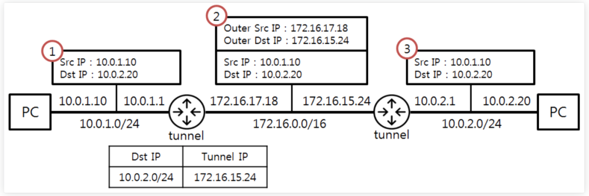
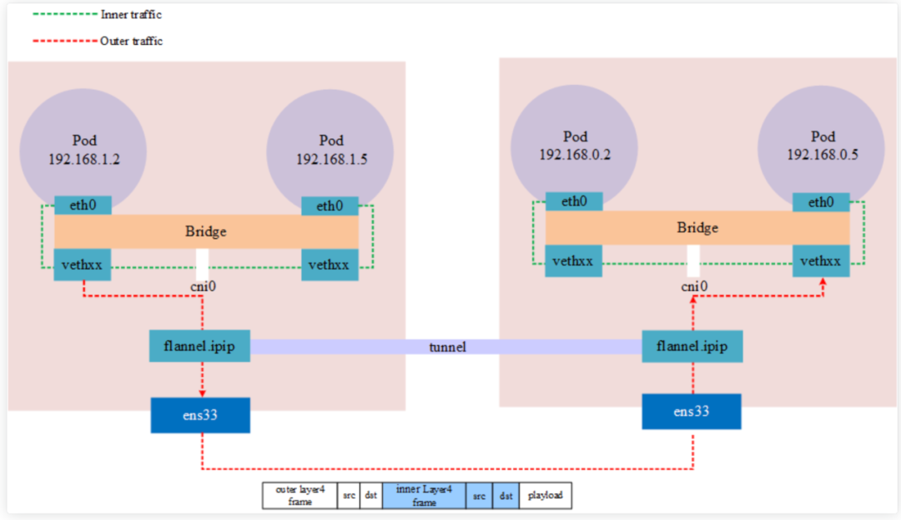
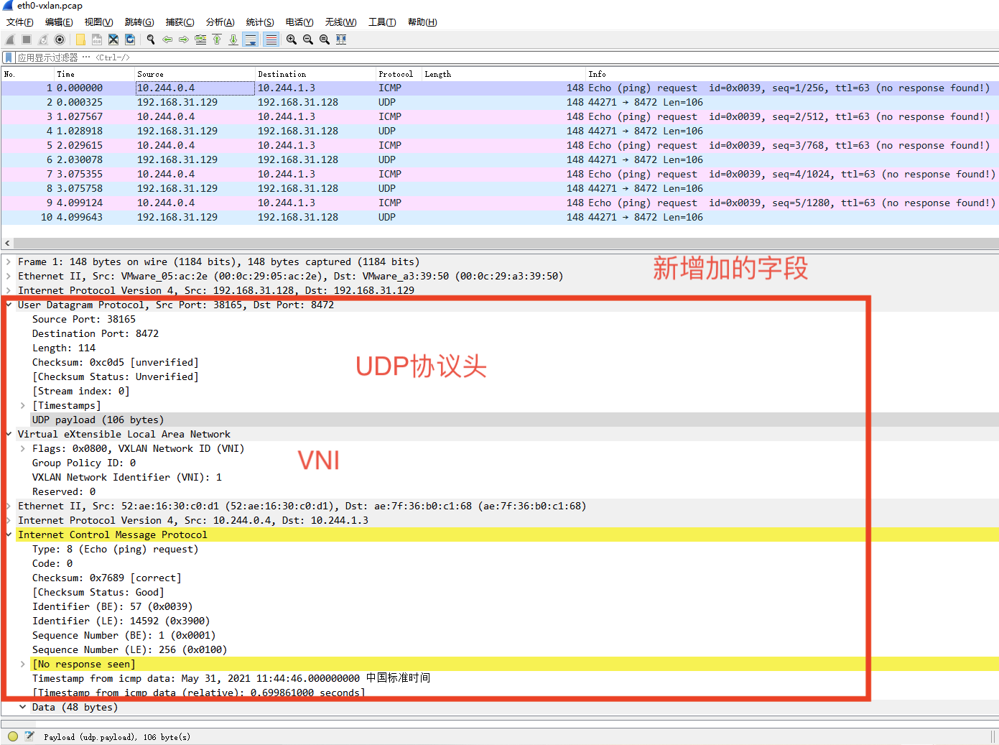

# IPIP and vxlan  Simple Comparison

> 本文档的功能在于调研和对比容器网络隧道技术，针对于 EdgeMesh CNI 应该使用怎样的技术做出资料规整

## why cni need IPIP or Vxlan 

**实现 CNI 时，为了给容器提供虚拟网络的隔离性和跨主机通信能力，就需要考虑 IPIP 以及 Vxlan 等技术**

在单节点上，通过创建虚拟网桥，然后将另一端插入到容器的 Veth 放入到网桥，这样链接在网桥上的容器之间就是二层可通的，但如果想让这些容器能够访问到网桥外的网络，包括本机的其他网桥以及节点之外的网络，就需要有合适的路由转发组件来完成。本机上的网络转发可以通过在路由规则中制定写死的网关，让容器之间和网桥之间可以访问，但如果涉及到节点之外的网络，尤其是二层不可通的网络当中，单节点往往难以知道数据包传输整个流程中的地址变化，而网络设备也不知道这些来自于容器的数据包地址该对应哪些链路和端口。

如果我们想要让容器的数据包可以传输到外界，就需要能够让节点外的网络设备或者是其他节点可以知道数据包转发的方向，而容器网络的地址和信息与底层网络设备并不一一对应，这就需要有借助于隧道技术，即IPIP， Vxlan 。当然为何就只讨论这两类技术呢？目前的答案是因为现有的 CNI 插件几乎都只关注于这两种技术的实现。

明白了 CNI 对隧道技术需求的原因，接下来深入分析 EdgeMesh  CNI 对这方面的需求。
	
EdgeMesh 针对的场景是对云边以及边边等复杂的边缘网络。相较于数据中心网络，边缘网络以及多集群网络最大的特征就是跨网段，物理设备二层不可通；其次就是资源受限，也就是说对于发包效率和存储管理并不能够像是数据中心那样更加随意和自由。与此同时，在 ServiceMesh 中，网络区段的界限并非与实际的物理网段一致，通过服务类型/部署形式等等，进行区分和流量控制也是需求之一。

到此我们可以大致绘制出 EdgeMesh CNI 的功能需求图谱了：
* 首先是场景中存在着子网内网络流量和子网间网络流量，CNI 需要对不同的网络流量提供联通服务，也就是说针对于p2p流量和集群流量要做区分不同服务；
* 其次是要兼容边缘节点资源受限的问题，尽量维持组件的轻量化，通讯成本低。
	
那么接下来我们继续深入来看看这两项技术各自的特征和好坏之处。
		
---

## what is IPIP
> IP in IP，一种IP隧道协议（IP Tunnel），将一个IP数据包，封装进另一个IP数据包中。为了封装IP数据包，在来源IP上要再加上一个外部的标头，隧道的进入点，目的位置，以及隧道离开的位置。
> [wiki IP in IP](https://zh.wikipedia.org/wiki/IP_in_IP)

其实从定义中已经非常明确说明这项技术的核心：在原本的数据包基础上增加一段IP字段

引用文章[Kubernetes Network Model](https://www.zentao.pm/blog/kubernetes-network-model-1379.html) 的示意图

从路由过程来看，当数据包离开了容器网段需要传输到外网的时候，会由本机的 IPIP 设备（是内核创建的转发设备 tunl,先暂时理解为一个内核进程将这些流量都拦截并对数据包做修改）
如下两图所示，我们可以清晰看到整个路由过程当中，IPIP隧道的创建和使用。

结构上来说，IPIP数据包只是在原有数据包的基础上增加了一段新的IP Header，总共20个字节。这段新的IP header 包含的是容器的地址，而外层的IP地址是本机的地址。数据包的路由就这样被自然分成了两个阶段，以下图为例，我们来梳理这个阶段的数据包传输。

当流量从节点外传输进入，首先使用的是外层IP地址进行路由转发，其目标地址和端口对应的是本机的IPIP设备的话，就会发往IPIP设备，之后外层的IP地址就被废弃去掉了，可以理解为经过这个IPIP设备外层地址就被扒去，数据包使用内层的地址进行路由，这个时候使用的IP地址就是容器网络的IP地址了

不过这里还有几处疑问需要接下来继续去探索解决：
1. 该怎样创建IPIP设备，其工作原理到底是什么样的呢？
2. 拦截了所有流量的这个内核IPIP设备是否会会成为系统性能的瓶颈？
3.  如何接入IPIP设备，使其灵活变化地址封装

此外还有一点可以明确的是，IPIP是纯工作在三层及以上的技术，因为这样的隔离使得数据包以IPIP设备作为分界线，划分出了物理网络和容器网络的边界，但是二层以下的设备却都还是共用的。

## what is vxlan 
> 虚拟局域网扩展（Virtual Extensible LAN, VXLAN）是一种网络虚拟化技术。它采用类似 VLAN 封装技术封装基于MAC含括第 4 层的UDP数据包的 OSI 第2层 以太网帧，使用 4789 作为默认分配的 IANA 目的地 UDP 端口号。

与 IPIP 对应，Vxlan 也是在原本的数据包基础上增加了额外的字段，总共50 Bytes(包括8个vxlan协议相关字节，8个UDP头部字节，20个IP头部和14个MAC头部字节)，
如下图所示：

相较于IPIP直接添加了一段IP Header， Vxlan还多增加了一些字段，如果说添加的IP Header 和IPIP一样，那么其他的字段又充当了什么样的角色呢？
* UDP Header:

    有不少的资料表述为 Vxlan 是基于UDP实现的Tunnel,所以数据包都是UDP数据包；这个表述是对的，但是在理解上却容易误导，因为 Vxlan 不是在已有的UDP数据包基础上建立隧道，而是在自己的协议中加入了 UDP Header 来保障传输数据的正确性

    这里有一个疑问是为何 UDP 工作在传输层(L4)协议却要比后面 Vxlan 工作在L2/L3层的MAC和IP要更早处理呢？这并不符合网络结构的逻辑。 \
    我们仔细观察数据包的结构，实际上不管内部的 VXlan，外层到 UDP 的字段都符合网络协议栈的处理，那我们完全可以这样去假设：数据包经过 UDP 协议会被传输给内核当中的 Vxlan 设备，然后这个内核设备会依据 Vxlan 标识重新将数据包导入到本机的 L2 协议栈，再使用容器网络的IP进行路由。

    也就是说 Vxlan 的数据包会多一次经过本机的L2网络协议栈。

* Vxlan Header: 

    关于 VIN 的作用和实现较为繁多，尤其是他涉及的 NetworkPolicy 以及 子网划分方面的内容，需要单独再出一片文章来做解释和实验。
    对于本篇文章来说，重点只需要知道这个部分的字段可以用于区别不同网段和服务类型就可以

* MAC Header:
    伪造的 MAC 字段，一般来说这个 MAC字段就是对应所创建的虚拟网桥（L2设备），当然这个部分的可填充型有待继续研究。

## pros and cons 

基本了解了二者的特征和实现原理之后，我们来继续深入研究对比一下两个方案。

1. 运行机制上均是在内核创建虚拟设备来做封包和解包

    二者都需要通过代码调用内核接口并创建对应的虚拟设备:
    * IPIP 创建 Tunl
    * Vxlan 创建 VTEP

    且都会作为容器网络的网关，修改封装所有的数据包，本身可能会随着容器数量的急剧增长而变成单节点网络性能的瓶颈，待之后研究。

2. 添加的字段大小和数量不同

    这一点也有不少的文章和资料指出，尤其是 Vxlan 报文相较 IPIP 更大，所以网络线路传输的有效数据占比较小，尤其是对于小包或者是信令数据之类的，因为无论是什么样功能的数据包，经过容器网络的封装，底层网络都会将他们当作同等重要的数据来进行服务和传输。
    但是对于网络的划分和更长远的服务发展来说，Vxlan 有更加完整的网络字段，能够将容器网络对流量的控制和划分深入到L2，同时Vxlan在冗余和其他高可用性解决方案方面具有很大的潜力；而IPIP限制于其简单添加的头部字段就无法脱离于网络三层来提供服务。

3. 适用场景并不相同
    IPIP 是一种相对简化的隧道机制。将IP封装在IP中实际上是为充当路由器的设备而设计的，因为在IP报头之后的唯一内容就是——下一个IP报头。接着通过使用IP协议字段来指示下一个报头，这样端点就可以知道是否再次循环内部数据包以进行路由决策，这个过程是独立于二层的，换句话说内部的 IP 地址不仅和外部的地址毫无关联影响，他们自己之间也没有相关关联，所有的解包和封包都是对单独一个包而言的，即便可能前前后后不断重复封装的都是同一个地址。
    总之，**IP-in-IP最终是点对点**的。

    VXLAN 最大 的特征就是一个VLAN标签，但它也不是像GRE和IPIP那样设计成点对点的。通过深入到二层的网络信息，使得它可以通过底层传输网络中的组播支持以太网BUM流量（广播、未知和组播）。换句话说，**VXLAN是完全多点的，可以完全模拟以太网段**，而不仅仅是其中的一个链路。

4. 性能和消耗不相同

    基于 arm 此前的一项[研究](https://static.linaro.org/connect/lvc20/presentations/LVC20-115-0.pdf)

    研究对比出来的数据较多，我这里只拿出本题关注的几点：
    * 单集群同网段间 IPIP 的性能体现要比 Vxlan 较好一点
    * IPIP 和 Vxlan 内核代理可能会成为性能瓶颈

## 参考文献
[1] https://www.quora.com/Is-IPIP-better-than-VXLAN/answer/Jean-Yves-Landry-1?__filter__=all&__nsrc__=notif_page&__sncid__=41563303444&__snid3__=55626021146  \
[2] https://vpnreviewopendiscussion.quora.com/Is-IPIP-better-than-VXLAN-1?comment_id=345922545&comment_type=2&__filter__=all&__nsrc__=notif_page&__sncid__=41580756912&__snid3__=55649647167   \
[3] https://ranchermanager.docs.rancher.com/v2.6/faq/container-network-interface-providers  \
[4] https://www.manageengine.com/network-monitoring/tech-topics/vxlan-vs-vlan.html   \
[5] https://www.cnblogs.com/janeysj/p/14291537.html   \
[6] https://forum.mikrotik.com/viewtopic.php?t=184769   \
[7] https://blog.crazytaxii.com/posts/k8s_cni/   \
[8] https://docs.tigera.io/calico/latest/networking/configuring/vxlan-ipip?ref=qdnqn.com   \
[9] https://www.zentao.pm/blog/kubernetes-network-model-1379.html   \

# 相关技术和架构调研汇总

| 组件名称 | 提供的网络隧道技术 | 连接服务情况 |
| --- | --- | --- |
| cilium | Native-Routing，Geneve，Vxlan | 支持 Kubernetes 和 Mesos |
| calico | IPIP, Vxlan | 支持 Kubernetes, OpenShift 和 Mesos |
| flannel | Vxlan, Host-GW, IPIP | 支持 Kubernetes, Mesos 和 Docker Swarm |
| Kilo | IPIP, Vxlan | 支持 Kubernetes |
