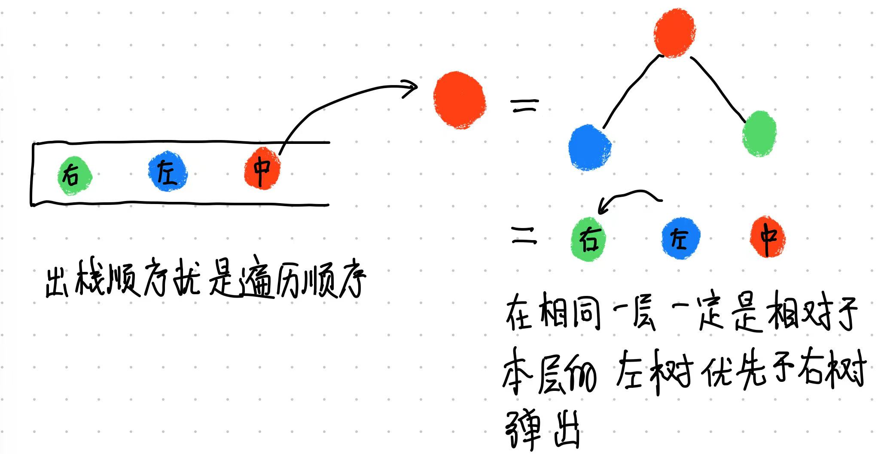
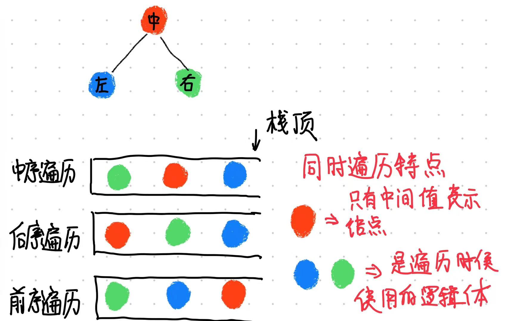

# 文档前言

当我完成了许多的算法题目以及其扩展题目之后，总是在那几天对于解决这类性特征的问题有着较多的见解，而且发现同类型特征的问题往往有着相似的解法，尤其是在我回顾一些问题却发现他们异常陌生的时候，我察觉到自己不能通过简单的肌肉记忆来提高解决问题的能力，重复和已经解决思考的部分应当有浓缩和归类的操作

本文档的主要内容将主要包含两个部分：
* 基础简单算法的模式化归纳：忽略代码实现的细节和边界条件，将算法当中最主要的公式和代码片段摘出
* 特征问题的通解归纳，将具有特征特点的问题归纳出一个通用的范式

# 二叉树

## 二叉树的遍历
在树的**深度优先**遍历算法当中（包括前序、中序、后序），常常使用的是递归的方式，也就是：

* <font color ='red'>前序遍历：中、左、右 </font>
* <font color ='red'>中序遍历：左、中、右 </font>
* <font color ='red'>后序遍历：左、右、中 </font>


### 颜色标记法

受到(henry)[https://leetcode.cn/problems/binary-tree-inorder-traversal/solution/yan-se-biao-ji-fa-yi-chong-tong-yong-qie-jian-ming/] 解题方法的启发

将树的遍历问题放到栈的逻辑下面，其实有几点问题：
* 入栈的元素只有两种： 指向节点的指针和空指针，类似于：`[1,null,2,null,3,null,4,null,5,null,6]`
* 出栈的时候操作的必定是一个有指向地址的指针，那么出栈操作代表些什么
* 怎样才能够区别出左子树和右子树呢？

栈是先进后出的数据结构，与递归和函数调用类似，越是靠近栈底的元素他在树的结构上就越高。而栈的这个特性保证了树的结构，也就是说左/右子树必定是在右/左子树之前弹出，换句话说除了当前遍历的节点node，他的左右在遍历过程其实中代表的是一棵树，继续向栈里推入元素就是在不断地展开他的树节点，而这样的顺序必定是被中间的Node所标志的，如图中所示


<div style="display:flex;flex-direction:row;"r>
    
    
</div>

\
回到上述三个问题来理解就会容易一些
1. 因为栈存储的是树，而不是节点，所以一些叶节点没有左右子树，这部分依旧还是会以逻辑形式入栈 
2. 出栈入栈是对应的，所以理解上也应该要对应起来说，第一次入栈只要该节点不是root，那么他必定是以某个节点的左右节点身份入栈的，此时的入栈操作标识的是当前节点为root 的子树，所以第一次出栈是用来将其从树的身份转化为节点，通过将其标记为 1 [有颜色，标志为确实为一个节点]，然后再入栈表示为遍历，当把整棵树放入栈中后，出栈操作则对应节点，此时栈中所有标记为1的部分就是实际遍历的节点，而且按照入栈的顺序表示出中、后、前序.
那么按照这样的思路，我们来编写一下对二叉树的中序遍历：

``` golang 
type TreeNode struct{
    Right *TreeNode
    Left  *TreeNode
    Val  int
}

//
func traversal(root *TreeNode) []interface{}{
    // 颜色点，用于标记出入栈
    type node struct{
        Color int
        Node *TreeNode
    }

    stack := make([]*node,0)
    stack = append(stack,node{0，root})

    // 需要的结果函数
    //result := make([]interface,0)
    res := make([]int,0)

    for len(stack) > 0{
        // 每次都取出栈顶元素进行判定
        n := stack[len(stack)-1]
        stack = stack[:len(stack)-1]

        if n.Node == nil {
            continue
        }

        if n.Color == 0{
            stack = append(stack,node{0,n.Node.Right})
            stack = append(stack,node{1,n.Node})
            stack = append(stack,node{0,n.Node.Left})
        }else{
            res = append(res, n.Node.Val)
        }
    }
    return res
}

```

在这段代码当中，由于标记方式的存在和入栈方式是两次入栈，所以几乎可以是模板样式来解决问题，而且好记忆

在代码当中可以修改的地方只有两处：
``` golang
    if n.Color == 0{
        【第一处】
        可以修改为不同的深度遍历顺序
        【前序遍历】：
        ···
            stack = append(stack,node{0,n.Node.Right})
            stack = append(stack,node{0,n.Node.Left}) 
            stack = append(stack,node{1,n.Node})   
        ···
        【中序遍历】
        ···
            stack = append(stack,node{0,n.Node.Right})
            stack = append(stack,node{1,n.Node})  
            stack = append(stack,node{0,n.Node.Left}) 
        ···
        【后序遍历】
        ···
            stack = append(stack,node{1,n.Node})  
            stack = append(stack,node{0,n.Node.Right})
            stack = append(stack,node{0,n.Node.Left}) 
        ···
    }else{
        【第二处】
        添加对当前node值的修改函数
    }
```

### 递归方法

使用递归最关键还是两条：
* 递归结束的条件
* 递归函数的结构

普通的前序遍历数组的代码：
```golang


```

# 常见运算标识

## 最大最小值

以下这两个都是可以接受多个变量参数的求最大最小值
``` golang
    func max(args ...int)int{
        m := args[0]
        for _,val := range args{
            if val > m{
                m = val
            }
        }
        return m
    }

    func min(args ...int)int{
        m := args[0]
        for _,val := range args{
            if val < m{
                m = val
            }
        }
        return m
    }
```

## 异或，同或
```golang
func xor(a, b bool) bool {
    return (a || b) && !(a && b)
}
```
```golang
func xnor(a, b bool) bool {
    return (a && b) || (!a && !b)
}
```


## 位运算

### 两数相加
```golang
func getSum(a int, b int) int {
    // 异或+与运算:时间复杂度O(logSum) | 空间复杂度O(1)
    a, b = a ^ b, (a & b) << 1
    for b != 0 {
        a, b = a ^ b, (a & b) << 1
    }
    return a
}
```

### 两数相除
```golang
func divide(dividend int, divisor int) int {
    if dividend==0 {return 0}
    if dividend==math.MinInt32 && divisor==-1 {return math.MaxInt32}

    diffSign:=false
    if (dividend<0)!=(divisor<0) {
        diffSign=true
    }

    i,j,sum := 0,0,0
    for {
        tmp:=0
        if diffSign {
            tmp=sum-divisor<<j
        }else{
            tmp=sum+divisor<<j
        }
        if (dividend>0 && tmp>dividend) || (dividend<0 && tmp<dividend) {
            if j==0 {break}
            j-- //步长减半
            continue
        }
        sum=tmp
        i+=1<<j
        j++ //步长加倍
    }

    if diffSign {
        return -i
    }
    return i
}
```


## 二维矩阵转置
``` golang
func transposeMatrix(matrix [][]int) [][]int {
    // 获取矩阵的行数和列数
    rows, cols := len(matrix), len(matrix[0])
    // 定义一个新的二维数组，用于存储转置后的矩阵
    transposed := make([][]int, cols)
    for i := range transposed {
        transposed[i] = make([]int, rows)
    }
    // 遍历原矩阵，将其每个元素放置在转置矩阵中的相应位置
    for i := 0; i < rows; i++ {
        for j := 0; j < cols; j++ {
            transposed[j][i] = matrix[i][j]
        }
    }
    return transposed
}
```